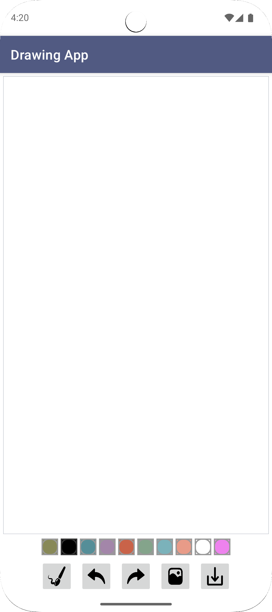
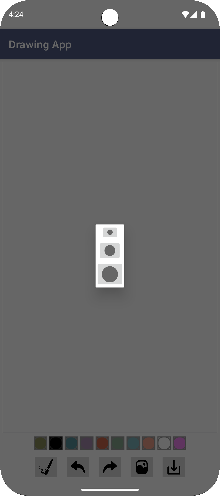
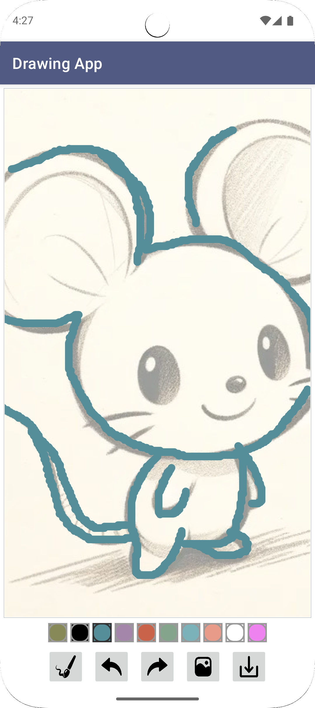

# Kids Drawing App (Kotlin)

A **Kotlin-based Android drawing app for kids**, allowing freehand sketches with adjustable brush size and color, undo/redo functionality, and the ability to save/share drawings.

## Features
✅ Freehand drawing on a canvas  
✅ Adjustable brush sizes  
✅ Color picker  
✅ Undo and redo actions  
✅ Save drawings to gallery  
✅ Share drawings with others  
✅ Clean MVVM Kotlin structure for learning and scalability

## Screenshots
  

## Tech Stack
- Kotlin
- Android Canvas API, Paint API
- ViewModel
- MediaStore

## Getting Started

1️⃣ Clone the repository:
```bash
git clone https://github.com/yourusername/KidsDrawingApp-Kotlin.git
